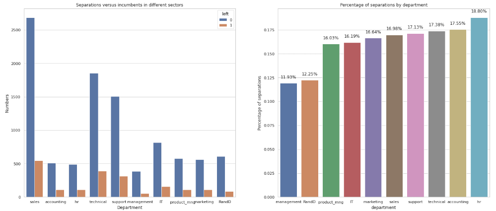
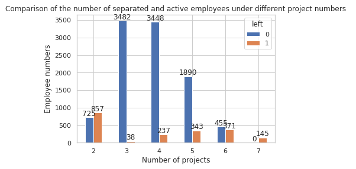
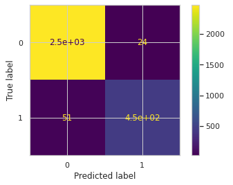

# Employee Turnover Prediction and Factor Analysis

## Project Overview
This data science project aims to help Salifort Motors' HR department predict employee turnover and identify key factors influencing resignations. By analyzing historical employee data, we developed a machine learning model to flag at-risk employees and provide actionable insights for retention strategies.

### Business Objective
- Predict likelihood of employee departure
- Identify primary drivers of turnover
- Provide data-backed recommendations for employee retention

## Dataset Description
​**15,000 employee records**​ with 10 features:

| Feature | Description | Range/Type |
|---------|-------------|------------|
| `satisfaction_level` | Self-reported job satisfaction | [0-1] |
| `last_evaluation` | Latest performance score | [0-1] |
| `number_project` | Active project count | Integer |
| `average_monthly_hours` | Monthly working hours | Integer |
| `time_spend_company` | Tenure (years) | Integer |
| `Work_accident` | Workplace accident history | Binary |
| `left` | Employment status | Binary |
| `promotion_last_5years` | Recent promotion | Binary |
| `Department` | Work division | Categorical |
| `salary` | Compensation tier | Ordinal |

## Key Analysis & Insights

### Data Preprocessing
- Removed 3,008 duplicate entries
- Standardized column names (snake_case)
- Addressed outliers in tenure (2-10 years range)
- Encoded categorical features (One-Hot & Ordinal)
- Normalized numerical features

### Exploratory Analysis

*Sales and Technical departments show highest turnover rates*

*Employees with 6-7 projects have 70%+ resignation rate*

## Predictive Modeling

### Model Selection
​**Random Forest Classifier**​ demonstrated best performance:
- Handles non-linear relationships
- Robust to outliers
- Feature importance interpretation

### Model Performance
| Metric | Score |
|---------|-------|
| Accuracy | 96.8% |
| Recall | 92.1% |
| F1-Score | 95.5% |

​**Confusion Matrix**:

## Key Drivers of Turnover
1. ​**Job Satisfaction**​ (28.4% importance)
2. Monthly Hours Worked (19.7%)
3. Performance Evaluation Score (15.2%)
4. Tenure Duration (12.8%)
5. Number of Projects (11.3%)

## Recommendations
1. ​**Workload Management**​
   - Implement project cap (max 5 projects/employee)
   - Monitor >250 hrs/month workload threshold

2. ​**Career Development**​
   - Increase promotion frequency
   - Create clear advancement paths

3. ​**Compensation Strategy**​
   - Review salary bands for high-turnover departments
   - Introduce performance-based bonuses

4. ​**Retention Programs**​
   - Targeted retention packages for 3-6 year tenure employees
   - Satisfaction improvement initiatives

## Technical Implementation

### Tools & Libraries
- Python 3.8+
- Pandas, NumPy
- Scikit-learn, XGBoost
- Matplotlib, Seaborn

## Ethical Considerations
- Anonymized employee data usage
- Bias checking in model predictions
- HR discretion in acting on predictions
- Regular model audits for fairness

## References
1. [Kaggle HR Analytics Dataset](https://www.kaggle.com/datasets/ludobenistant/hr-analytics)
2. [Scikit-learn Documentation](https://scikit-learn.org/stable/)
3. [AI Ethics Guidelines](https://www.partnershiponai.org/about-ml/)

---

​**Contributors**: Ma Long  
​**Last Updated**: April 2025
